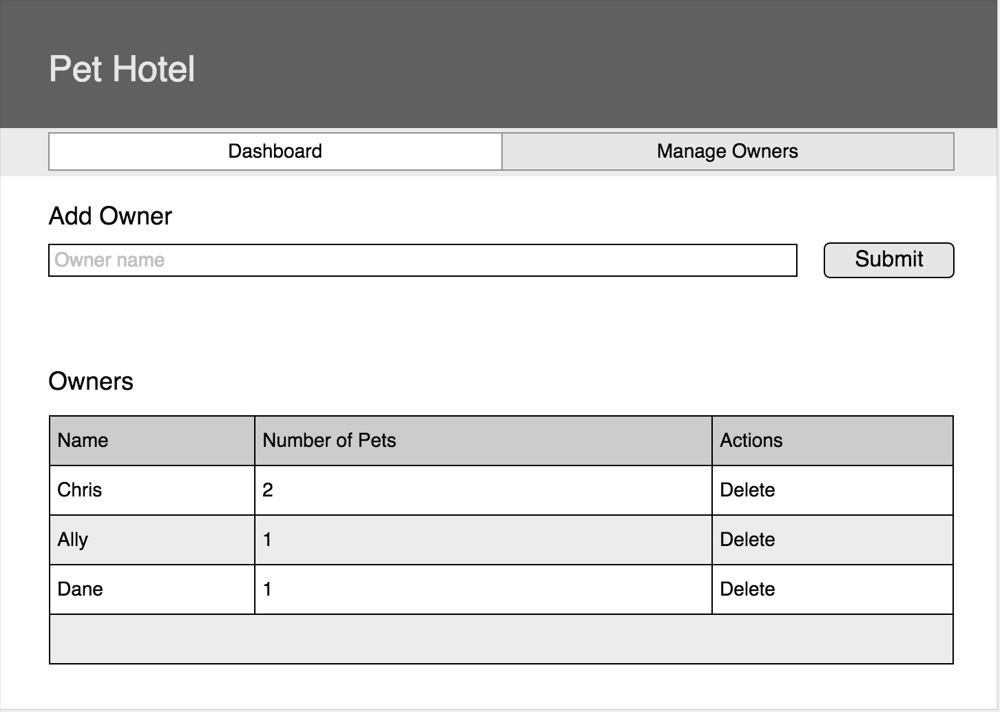

## Objectives

- build a full-stack application, writing the backend in a new language
- utilize separate GitHub repositories for the client-side and server-side of an application
- build confidence w/ SQL statements for CRUD and 1-M joins

## Technology

We are replacing our Node/Express/PG server with other serverside tech. Your RESTful API server needs to be able to route requests, respond, and talk to our PostGRES database.

Be sure to try to focus your Googling to API Servers with these stacks. There are tutorials for all of these where the focus is to get a basic REST API server up and running.

### Tech Guide

These are suggested frameworks and DB connectors for each stack:

- Python / Flask (web framework)
  - `psycopg2` for DB connection and queries

## Client Side

The client side should remain React, Redux, Redux Sagas as needed. You will need to create one repo for your React application and another for the server. This will disrupt your usual workflow!

You may run into proxy issues as you try to get axios to make requests to another port. Try to work through them. Recall the `proxy` setting we have been adding to our `package.json`...

## Features

- Add owners
- Add pets
- Remove owners if no pets are assigned
- Remove pets
- Check in / out a pet
- Show total number of pet next to each owner

### Wireframes

#### Dashboard View

#### Manage Owners View

### Database

Start with two tables **pets** & **owners**. When base features are complete, add more tables as needed for stretch goals.

## Documentation

Before moving on past Base features, please take time to comment your code and otherwise document what you've learned about your new server side technology stack. The rest of your cohort will benefit from your trailblazing!

## Other Features

- Update pets and owners
- Keep track of visits (you may need another table or two for this)
- Add images for pets
